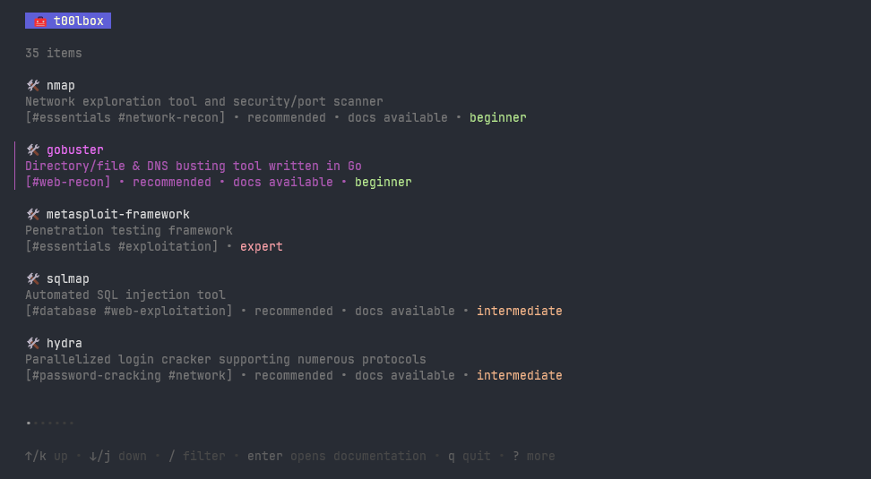
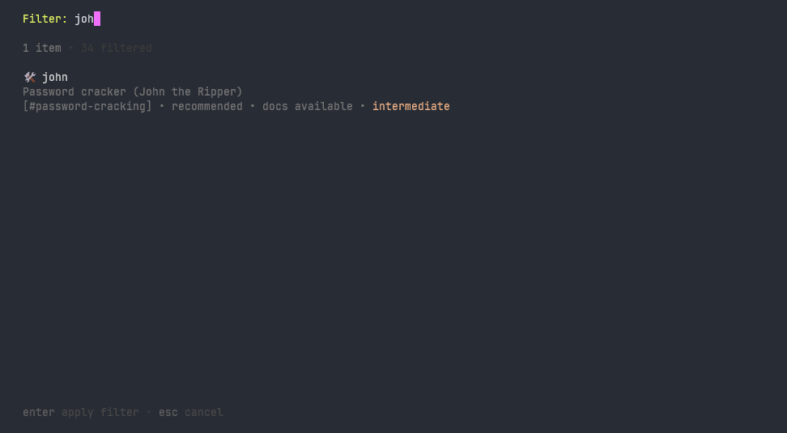
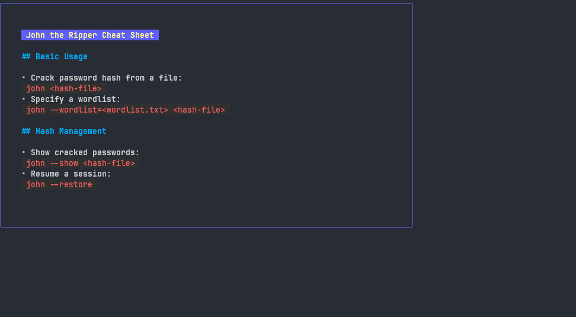

# 🧰 t00lbox

t00lbox is a small CLI tool that displays a searchable list of packages and resources, a novice hacker could need. It show markdown cheatsheets for some of those programs


## Features

- Search & Filter
    - Filter a list of applications & resources
    - Full text search
    - Search for categories
- Cheat Sheets
    - view quick cheat sheets for some applications
- Hand picked selection
    - ranked in levels (beginner, intermediate, expert)
    - certain applications / resources are recommended for a quick start


## Screenshots






## Installation

* Prerequsites
    * go >= 1.23.2

```bash
  go install github.com/burgr033/t00lbox/cmd/t00lbox
```

## Acknowledgements

 - [Bubbletea TUI framework](https://github.com/charmbracelet/bubbletea)


## Contributors

- [@burgr033](https://www.github.com/burgr033)


## Contributing

Code & Resource contributions are always welcome!

If there is an application missing in the YAML file, please open a pull request or an issue.

Informations needed:

```yaml
  - name: "name of application or resource"
    description: "short description"
    recommended: true|false # is it recommended for a quick start
    categories: ["CATEGORY1","CATEGORY2"]
    level: 1|2|3 # Beginner;Intermediate;Expert
    software: true|false # Is it a software or a resource
```
